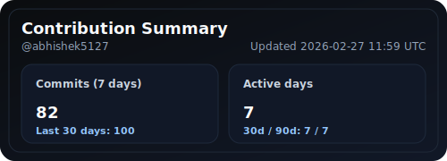
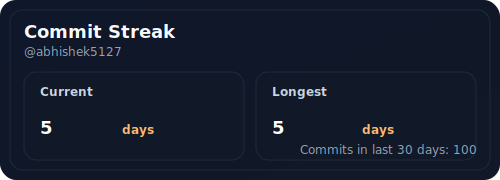
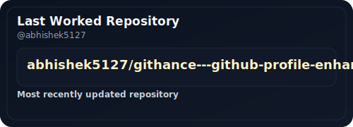
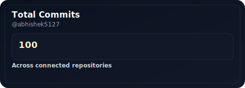
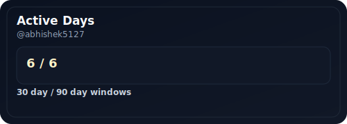
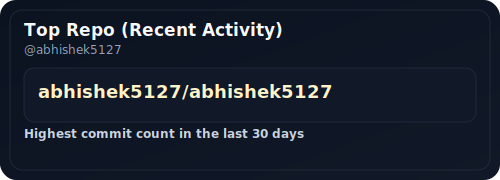

  

<h3>Full-stack developer</h3><h6>&nbsp;building production-ready web applications with JavaScript, React, and MongoDB. Specializes in authentication systems, AI-powered tools, and educational platforms. Created MERN authentication system with signup, login, and password reset functionality. Built AI Resume Builder that generates tailored resumes from user inputs. Developed College Syllabus Clarity platform for academic organization. Launched GitHance, a GitHub profile enhancer tool. Deployed multiple projects on Vercel with responsive, user-centric designs. Combines modern web technologies with practical problem-solving to deliver impactful digital solutions.</h6>

## Tech Stack

### Languages:

  
  

### Libraries & Frameworks:

  
  
  
  

### Tools & Platforms:

  
  
  

### Databases:

  
  

<table>
  <tr>
<td align="center" valign="top">

  

</td>
<td align="center" valign="top">

  

</td>
<td align="center" valign="top">

  

</td>
  </tr>
</table>

## Repo Commit Stats

  

  

