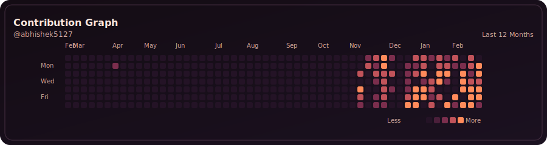

  

 
<h4>Full-stack JavaScript developer</h4><h6><i>building modern web applications with React, Node.js, and MongoDB. Specializes in authentication systems, AI-powered tools, and educational platforms. Created MERN authentication with secure signup/login/reset flows. Built AI Resume Builder that generates tailored resumes from user inputs. Developed College Syllabus Clarity for academic organization. Launched GitHance for GitHub profile enhancement. Deployed multiple production applications on Vercel. Strong focus on user experience and practical problem-solving.</i></h6>

## Tech Stack

### Languages:

  
  

### Libraries & Frameworks:

  
  
  
  

### Tools & Platforms:

  
  
  

### Databases:

  
  

  

  

