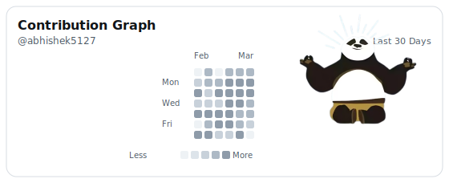

  

<h6><i>Full-stack developer building modern web applications with JavaScript, React, and Python. Specializes in authentication systems, AI-powered tools, and educational platforms. Created MERN authentication with MongoDB Atlas for secure user management. Built AI Resume Builder using advanced algorithms to generate tailored resumes from minimal user input. Developed College Syllabus Clarity platform for academic organization. Launched GitHance, a GitHub profile enhancer deployed on Vercel. Experienced in data analytics and security with Java vulnerabilities checker. Focuses on creating intuitive, production-ready solutions that solve real-world problems through clean code and thoughtful design.</i></h6>

## Tech Stack

### Languages:

  
  
  
  

### Libraries & Frameworks:

  
  
  
  

### Tools & Platforms:

  
  
  

### Databases:

  
  

  

