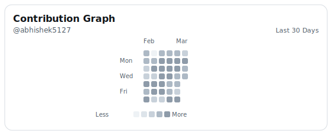

  

<h6 style="text-align: right;"><i>Full-stack developer building modern web applications with JavaScript, React, and Python. Specializes in authentication systems, AI-powered tools, and educational platforms. Created MERN authentication with MongoDB Atlas for secure user management. Built AI Resume Builder using advanced algorithms to generate tailored resumes from minimal input. Developed College Syllabus Clarity for academic organization. Launched GitHance, a GitHub profile enhancer deployed on Vercel. Passionate about creating intuitive, production-ready solutions that solve real-world problems.</i></h6>

## Tech Stack

### Languages:

  
  
  
  

### Libraries & Frameworks:

  
  
  
  

### Tools & Platforms:

  
  
  

### Databases:

  
  

<table border="0" cellpadding="0" cellspacing="0" style="border: 0; border-collapse: separate;">
  <tr style="border: 0;">
<td align="center" valign="top" style="border: 0; padding: 0 8px;">

  

</td>
<td align="center" valign="top" style="border: 0; padding: 0 8px;">

  

</td>
  </tr>
</table>