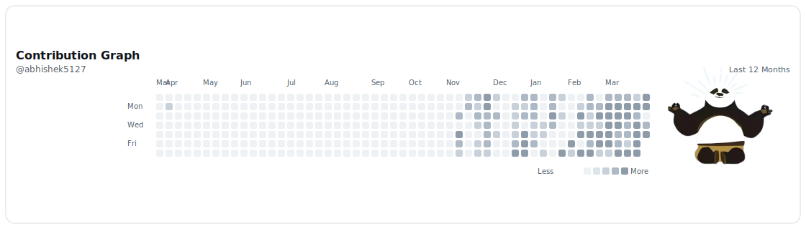
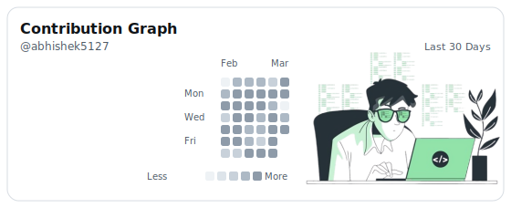

  

<h5><i>Full-Stack Developer building thoughtful software which solves everyday internet problems in a creative and unique approach. Expert in SaaS apps, system design, scalable integrations &amp; effective SERP.</i></h5>

## Tech Stack

<table cellpadding="8" cellspacing="0">
  <tr>
<td align="center" valign="middle" width="84" height="84"></td>
<td align="center" valign="middle" width="84" height="84"></td>
<td align="center" valign="middle" width="84" height="84"></td>
<td align="center" valign="middle" width="84" height="84"></td>
  </tr>
  <tr>
<td align="center" valign="middle" width="84" height="84"></td>
<td align="center" valign="middle" width="84" height="84"></td>
<td align="center" valign="middle" width="84" height="84"></td>
<td align="center" valign="middle" width="84" height="84"></td>
  </tr>
  <tr>
<td align="center" valign="middle" width="84" height="84"></td>
<td align="center" valign="middle" width="84" height="84"></td>
<td align="center" valign="middle" width="84" height="84"></td>
<td align="center" valign="middle" width="84" height="84"></td>
  </tr>
  <tr>
<td align="center" valign="middle" width="84" height="84"></td>
<td align="center" valign="middle" width="84" height="84">&nbsp;</td>
<td align="center" valign="middle" width="84" height="84">&nbsp;</td>
<td align="center" valign="middle" width="84" height="84">&nbsp;</td>
  </tr>
</table>

  

## Little Handles

  &nbsp;&nbsp;
  &nbsp;&nbsp;
  

<table>
  <tr>
<td align="center" valign="top">

  

</td>
<td align="center" valign="top">

  

</td>
  </tr>
</table>

<table>
  <tr>
<td align="center" valign="top">

  

</td>
<td align="center" valign="top">

  

</td>
  </tr>
</table>

  

  

