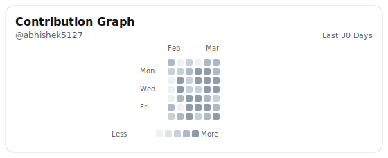

  

<h4>Full-stack developer</h4><h5><i>specializing in JavaScript, React, and Python. Builds scalable web applications with MERN stack expertise. Created authentication systems, AI-powered resume builders, and educational platforms. Deployed projects include GitHub profile enhancer, college syllabus clarity tool, and AI resume builder. Focuses on data-driven solutions and user authentication. Strong background in modern web development and AI integration.</i></h5>

## Tech Stack

### Languages:

  
  
  
  

### Libraries & Frameworks:

  
  
  
  

### Tools & Platforms:

  
  
  

### Databases:

  
  

<table>
  <tr>
<td align="center" valign="top">

  

</td>
<td align="center" valign="top">

  

</td>
  </tr>
</table>