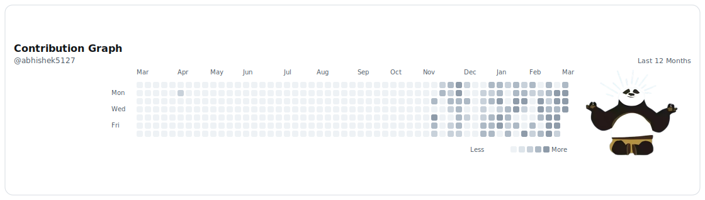

  

<h4>Full-stack developer</h4><h6><i>&nbsp;building production-ready web applications with JavaScript, React, and Python. Specializes in authentication systems, AI-powered tools, and educational platforms. Created MERN authentication system with MongoDB Atlas for secure user management. Built AI Resume Builder that generates tailored resumes from minimal user input. Developed College Syllabus Clarity platform for academic organization. Launched GitHance, a GitHub profile enhancer deployed on Vercel. Combines modern web technologies with practical problem-solving to deliver impactful digital solutions.</i></h6>

---

### 💻 Tech Stack

#### Languages:

  
  
  
  

#### Libraries & Frameworks:

  
  
  
  

#### Tools & Platforms:

  
  
  

#### Databases:

  
  

<table border="0" cellpadding="0" cellspacing="0" style="border: 0; border-collapse: separate;">
  <tr style="border: 0;">
<td align="center" valign="top" style="border: 0; padding: 0 8px;">

  

</td>
<td align="center" valign="top" style="border: 0; padding: 0 8px;">

  

</td>
  </tr>
</table>

  

